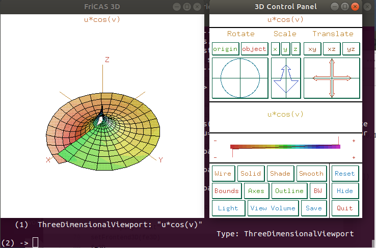
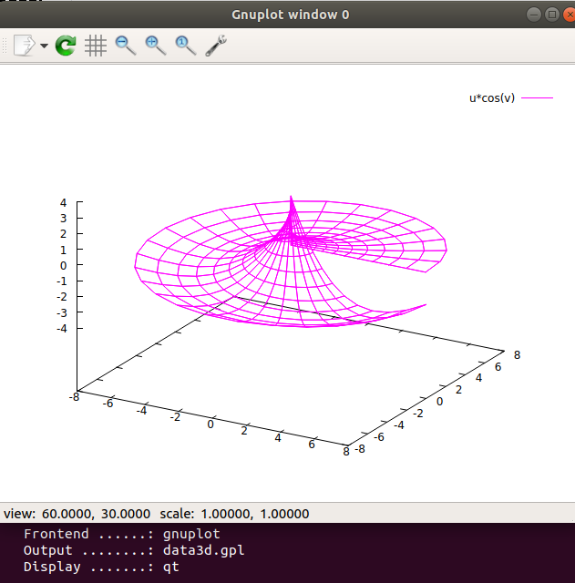
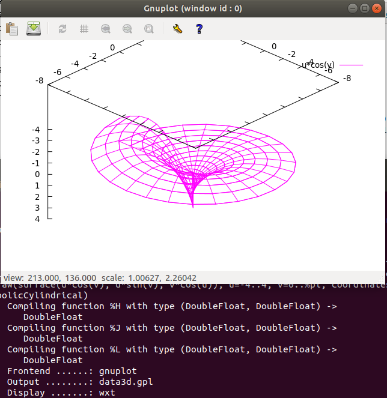

# fricas_drawfe :construction: :rocket:
More frontends for FriCAS plotting routines (``draw``).

In order to provide other frontends than the built-in (X11 based) 
comparatively few changes to ``view2D.spad`` and ``view3D.spad`` are
necessary. To avoid confusion the files were (temporarily) renamed to 
``view2D+.spad`` and ``view3D+.spad`` respectively. 

> Initial changes to ``view2D.spad`` and ``view3D.spad``
> see [Commit: d21784c](https://github.com/nilqed/fricas_drawfe/commit/d21784c9c808d80c02e8c8272f2b49255cb86566)

---

For the demo you have to install at least ``gnuplot-qt``:

	$ sudo apt install gnuplot-qt
	
	$ apt list gnuplot*
	Listing... Done
	gnuplot/bionic,bionic 5.2.2+dfsg1-2ubuntu1 all
	gnuplot-data/bionic,bionic,now 5.2.2+dfsg1-2ubuntu1 all [installed,automatic]
	gnuplot-doc/bionic,bionic 5.2.2+dfsg1-2ubuntu1 all
	gnuplot-mode/bionic,bionic 1:0.7.0-1 all
	gnuplot-nox/bionic 5.2.2+dfsg1-2ubuntu1 amd64
	gnuplot-qt/bionic,now 5.2.2+dfsg1-2ubuntu1 amd64 [installed]
	gnuplot-x11/bionic 5.2.2+dfsg1-2ubuntu1 amd64

> The 3 files have to be compiled in the following order:

	)co drawfe
	)co view2D+
	)co view3D+

> Example (viewman, default)

	draw(surface(u*cos(v), u*sin(v), v*cos(u)), u=-4..4, v=0..%pi, coordinates== parabolicCylindrical)
	

> Get/set a frontend (gnuplot/qt):

        fe3D := getFrontend3D()
        
        fe3D.'type    := "gnuplot"
        fe3D.'output  := "data3d.gpl"
        fe3D.'display := "qt"
        
        setFrontend3D(fe3D)
        
        draw(surface(u*cos(v), u*sin(v), v*cos(u)), u=-4..4, v=0..%pi, coordinates== parabolicCylindrical)

> Set display to ``wxt``

        fe3D.'display := "qt"
        setFrontend3D(fe3D)
        
        draw(surface(u*cos(v), u*sin(v), v*cos(u)), u=-4..4, v=0..%pi, coordinates== parabolicCylindrical)

The difference is that you can interactively **rotate**, **scale**, ... the surface :)

> Back to viewman:

        fe3D.'type := "vieman"
        setFrontend3D(fe3D)

Non-interactive (create Postscript, SVG etc.)
---------------------------------------------

Details in ``demo_drawfe.input``:
        
        fe3D.'display:="postscript; set output 'test.ps'"
        setFrontend3D(fe3D)
        draw(surface(n1,n2,n3), 1..4, 1..2*%pi, coordinates == toroidal(1$DFLOAT)) 

        fe3D.'display:="postscript; set output 'test2.ps'"
        setFrontend3D(fe3D)
        draw(m, 0..2*%pi,0..%pi, coordinates == spherical) 

        fe3D.'display:="svg background 'black'; set output 'test.svg'"
        setFrontend3D(fe3D)
        draw(curve(5*cos(t), 5*sin(t),t), t=-12..12) 

        fe3D.'display:="svg background 'blue'; set output 'test2.svg'"
        setFrontend3D(fe3D)
        draw(m, 0..2*%pi,0..%pi, coordinates == spherical) 

 
